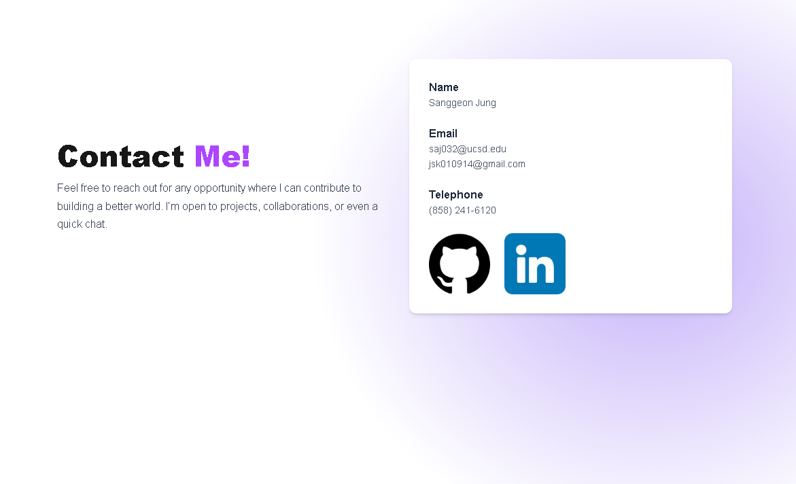

# 💻 Sanggeon Jung – Personal Portfolio Website

This is my personal portfolio website, designed and developed to showcase my projects, background, and interests in frontend development.

Built with **Next.js App Router** and **Tailwind CSS**, this site highlights responsive design, clean component structure, and modern UI patterns.

---

## ✨ Features

- 🌐 Fully responsive layout across desktop and mobile
- 🔁 Smooth scroll navigation and intuitive section-based structure
- 🎨 Radial background gradients for visual flair
- 💼 Highlighted project cards with GitHub links and descriptions
- 📬 Contact section with email, phone, and social icons

---

## 🚀 Tech Stack

- **Frontend Framework**: Next.js (App Router)
- **Styling**: Tailwind CSS
- **Type System**: TypeScript
- **Deployment**: Vercel
- **Design Tools**: Figma (layout reference)

---

## 🔍 Preview

> 📸 Screenshot preview (add one here!)  

---

## 📌 Project Highlights

| Section      | Description |
|--------------|-------------|
| **Hero**     | Bold personal introduction with gradient title and image |
| **About**    | "Three countries in my life" – personal journey and cultural identity |
| **Projects** | List of key projects with descriptions and stack |
| **Contact**  | Name, email, phone, LinkedIn & GitHub links |

---

## 🧑‍💻 Author

**Sanggeon Jung**  
- 💼 Junior Computer Science Student at UC San Diego  
- 📧 saj032@ucsd.edu / jsk010914@gmail.com  
- 🔗 [GitHub](https://github.com/TopgeonKR) | [LinkedIn](https://www.linkedin.com/in/sanggeon-jung)

---